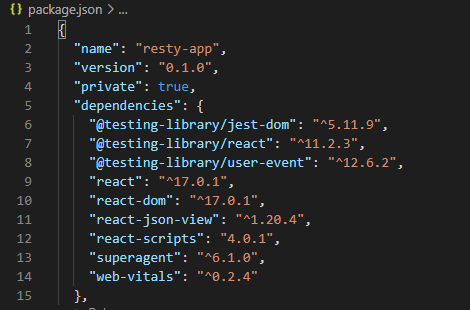
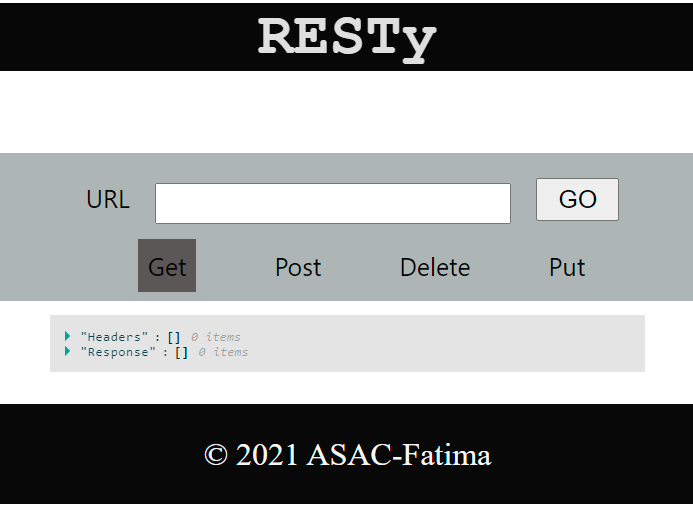

# RESTy

### Author: Fatima Atieh

## Setup

* For best experience go to the root of your local machine folders and create the directoty from there to clone your repo

* Points: 1 & 2 , do them only if you didn't do them before and you're creating a new app

1. Run the command `npx create-react-app name-of-app`

2. Run `npm install node-sass@4.14.1`

3. `cd your-app-name`

4. Write your code

5. Dependencies: 

6. Run `npm run start`

Now you will get something similar to the image below on `localhost:3000`

Then add the URL and choose the method then hit `GO`

you will get something similar to this

## Deploy on Netlify

1. `npm run build`

2. If you **don't have netlify installed** on your LM use the following command 
`npm install netlify-cli -g`

3. `netlify deploy`

4. You might get a pop-up window which will ask you to log in with Netlify and grant access to the Netlify CLI.
click `Authorize`

5. Continue as mentioned in this blog [How to deploy a React application to Netlify](https://www.freecodecamp.org/news/how-to-deploy-a-react-application-to-netlify-363b8a98a985/)

